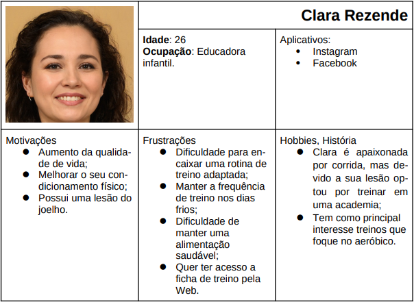
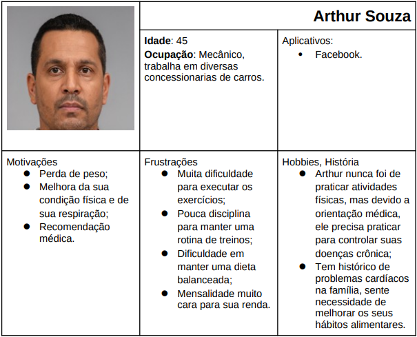
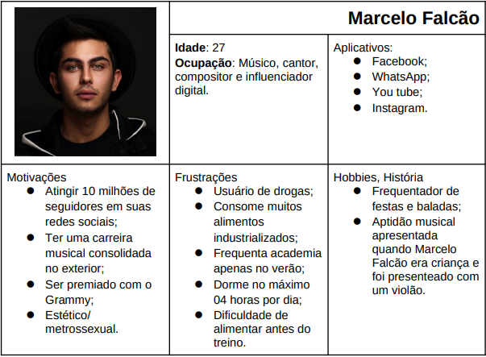
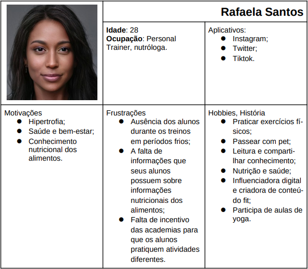
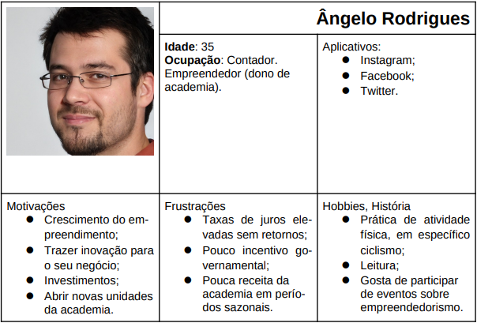

# Especificações do Projeto

A definição exata do problema e os pontos mais relevantes a serem tratados neste projeto foi consolidada com a participação dos usuários em um trabalho de imersão feita pelos membros da equipe a partir da observação dos usuários em seu local natural e por meio de entrevistas. Os detalhes levantados nesse processo foram consolidados na forma de personas e histórias de usuários.

## Personas

As personas levantadas durante o processo de entendimento do problema são apresentadas na Figuras que se seguem.

 

## Histórias de Usuários

Com base na análise das personas forma identificadas as seguintes histórias de usuários:

|EU COMO... `PERSONA`| QUERO/PRECISO ... `FUNCIONALIDADE` |PARA ... `MOTIVO/VALOR`                 |
|--------------------|------------------------------------|----------------------------------------|
|Aluno Arthur Souza  | Desejo obter informações sobre como a prática de atividades físicas no inverno traz benefícios para a saúde.       | Porque tenho problemas com o meu condicionamento físico, estas informações me interessam, pois quero melhorar a minha forma física.    |
|Aluna Clara Rezende | Quero obter acesso aos conteúdos digitais e dicas de treino em um site próprio.| Porque tenho interesse em conteúdos digitais para me auxiliar a praticar exercícios. |
|Personal trainer Rafaela Santos| Quero divulgar informações sobre hábitos saudáveis de alimentação em dias frios.|Hábitos saudáveis de alimentação em dias frios potencializam os resultados da prática de exercícios.|
|Empresário Ângelo Rodrigues| Gostaria de montar uma página onde os alunos possam visualizar dúvidas gerais.|Para melhorar o atendimento ao cliente, podendo sanar as dúvidas dos alunos de uma forma mais rápida e precisa. | 
|Empresário Ângelo Rodrigues|Quero melhorar a comunicação e a relação com os clientes.|Para que eu possa fortalecer o relacionamento com os clientes e fidelizá-los.| 
|Empresário Ângelo Rodrigues| Gostaria de criar um portal informativo para atrair novos clientes. | Para obter mais destaque no meio da internet e melhorar o acesso à informação, para expandir o meu negócio.|   
|Aluno Arthur Souza  | Desejo ter acesso a informações nutricionais personalizadas de acordo com o meu histórico médico.| Para que eu possa saber os horários e os intervalos recomendados para alimentação, quantidade ideal e os tipos de alimentos indicados para as minhas necessidades. |   
|Aluno Marcelo Falcão| Quero saber como fazer uma alimentação pré-treino.| Porque preciso ter energia e estar preparado para a realização das atividades durante os treinos na academia.|   
|Aluna Clara Rezende | Gostaria de poder publicar o meu relato na internet, juntamente com a minha experiência praticando treino na academia.|Para que eu possa incentivar outras pessoas que possuem interesse em praticar atividades físicas, compartilhando o meu processo de adaptação e os resultados obtidos.|   
|Aluna Rafaela Santos| Quero poder divulgar dicas de treinos e treinos para os alunos poderem praticar. | Para facilitar aos alunos o acesso à informação e orientá-los sobre a forma correta de se executar um treino na academia.|   
|Aluno Marcelo Falcão|Desejo ter dicas e acompanhamento especial para obter resultados hipertróficos na academia.|Porque meu interesse em praticar atividades físicas está na melhora da minha aparência física, busco ter um corpo mais definido.| 
|Aluna Rafaela Santos| Quero poder calcular meu IMC. | Para facilitar aos alunos na ora de orientá-los com dieta e treino.|    

## Requisitos

O escopo funcional do projeto é definido por meio dos requisitos funcionais que descrevem as possibilidades interação dos usuários, bem como os requisitos não funcionais que descrevem os aspectos que o sistema deverá apresentar de maneira geral. Estes requisitos são apresentados a seguir.

### Requisitos Funcionais

|ID    | Descrição do Requisito  | Prioridade |
|------|-----------------------------------------|----|
|RF-001| O site deve possuir uma área de depoimentos para os alunos relatarem suas experiencias.  | MÉDIA | 
|RF-002| O site deve possuir informações sobre treinos divulgados na plataforma.    | ALTA |
|RF-003| O site deve apresentar informações nutricionais personalizadas com horários e os intervalos recomendados para a alimentação, quantidade ideal e os tipos de alimentos indicados de acordo com o perfil do aluno. | ALTA  |
|RF-004| O site deve apresentar informações sobre os alimentos recomendados para uma alimentação pré-treino.  | ALTA  |
|RF-005| O site deve apresentar as experiências vivenciadas pelos alunos que frequentam regularmente a academia. Experiências que vão além da prática de exercícios físicos, como o contato com novas pessoas e o compartilhamento de experiências de qualidade de vida e cuidados com o corpo. | MÉDIA |
|RF-006| O site deve ter conteúdos sobre os benefícios de praticar atividades em dias frios. | ALTA   |
|RF-007| O site deve apresentar curiosidades, informações pouco conhecidas sobre atividades físicas em dias frios para conscientização e motivação do usuário. | MÉDIA |
|RF-008| O site deve apresentar na página inicial atalhos do conteúdo que será disponibilizado no site, facilitando a navegação. | MÉDIA |
|RF-009| O site deve apresentar um espaço para o usuário enviar seu relato/experiência. | MÉDIA |
|RF-010| O site deve apresentar um espaço para o usuário calcular seu IMC. | MÉDIA |

### Requisitos não Funcionais

|ID     | Descrição do Requisito  |Prioridade |
|-------|-------------------------|----|
|RNF-001| O site deve ser publicado em um ambiente acessível publicamente na Internet (Repl.it, GitHub Pages, Heroku). | ALTA | 
|RNF-002| O site deverá ser responsivo permitindo a visualização em um celular de forma adequada. |  ALTA |
|RNF-003| O site deve ter bom nível de contraste entre os elementos da tela em conformidade. |  MÉDIA | 
|RNF-004| O site deve ser compatível com os principais fontes e navegadores do mercado (Google Chrome, Firefox, Microsoft Edge). |  ALTA | 
|RNF-005| Uso de componentes gráficos (grids, barras de rolagem, menus). |  ALTA | 

Com base nas Histórias de Usuário, enumere os requisitos da sua solução. Classifique esses requisitos em dois grupos:

- [Requisitos Funcionais
 (RF)](https://pt.wikipedia.org/wiki/Requisito_funcional):
 correspondem a uma funcionalidade que deve estar presente na
  plataforma (ex: cadastro de usuário).
- [Requisitos Não Funcionais
  (RNF)](https://pt.wikipedia.org/wiki/Requisito_n%C3%A3o_funcional):
  correspondem a uma característica técnica, seja de usabilidade,
  desempenho, confiabilidade, segurança ou outro (ex: suporte a
  dispositivos iOS e Android).
Lembre-se que cada requisito deve corresponder à uma e somente uma
característica alvo da sua solução. Além disso, certifique-se de que
todos os aspectos capturados nas Histórias de Usuário foram cobertos.

## Restrições

As questões que limitam a execução desse projeto e que se configuram como obrigações claras para o desenvolvimento do projeto em questão são apresentadas na tabela a seguir.

|ID| Restrição                                             |
|--|-------------------------------------------------------|
|01| O projeto deverá ser entregue no final do semestre letivo, não podendo extrapolar a data de 26/06/2022. |
|02| O aplicativo deve se restringir às tecnologias básicas da Web no Front End.       |
|03| A equipe não pode subcontratar o desenvolvimento do trabalho.        |

