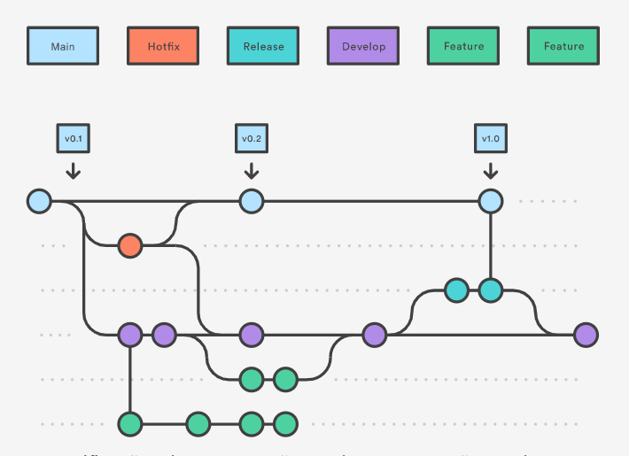
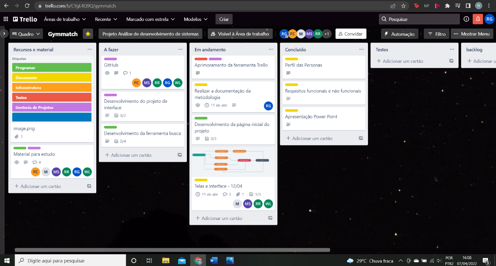

# Metodologia

A metodologia diz respeito aos recursos e ferramentas que o grupo utilizou no nosso trabalho, para a concepção da nossa pesquisa escolhemos o método ágil, em específico o SCRUM, que seria segundo Fábio Cruz:

Scrum é um framework estrutural que está sendo usado para gerenciar o desenvolvimento de produtos complexos desde o início da 1990. Scrum não é um processo ou uma técnica para construir produtos; em vez disso, é um framework dentro do qual você pode empregar vários processos ou técnica [...] esta definição consiste em papéis, eventos, artefatos e as regras do Scrum que unem os demais e os mantem integrados (CRUZ,2018).

## Controle de Versão

A ferramenta de controle de versão adotada no projeto foi o
[Git](https://git-scm.com/), sendo que o [Github](https://github.com)
foi utilizado para hospedagem do repositório.

O projeto segue a seguinte convenção para o nome de branches:

- `main`: versão estável já testada do software
- `unstable`: versão já testada do software, porém instável
- `testing`: versão em testes do software
- `dev`: versão de desenvolvimento do software

Quanto à gerência de issues, o projeto adota a seguinte convenção para
etiquetas:

- `documentation`: melhorias ou acréscimos à documentação
- `bug`: uma funcionalidade encontra-se com problemas
- `enhancement`: uma funcionalidade precisa ser melhorada
- `feature`: uma nova funcionalidade precisa ser introduzida

Para gestão do código fonte do software desenvolvido pela equipe, o grupo utiliza um processo baseado no Git Flow, publicado pela primeira vez e popularizado por Driessen em 2010.

  
Exemplificação do modelo de trabalho Git Flow

Segundo Antunes (2021), o Git Flow delimita um método de branchs bem estabelecidos, concebidos e fundados pelas releases. Isto dá origem a uma base sólida que controla projetos maiores. O Git Flow trabalha com seis branchs ao todo, sendo o Develop e o Main os principais, que duram por todo projeto; enquanto Suporte, Feature, Bugfix e Hotfix que existem até se fundirem com as branches principais.

## Gerenciamento de Projeto

No que se diz respeito a divisão de funções e a organização do grupo, o grupo está utilizando a ferramenta Trello, que foi elaborado para trabalhar a base do método kanban, que foi estruturado da seguinte forma:

    
• Recursos e material: Este template tem como função a de identificar o significado das etiquetas empregadas na nossa pesquisa, juntamente com facilitar a busca de material acadêmico para a elaboração do projeto.

    
• Backlog: Representa o Product Backlog do nosso projeto, todas as atividades realizadas no decorrer se encontram presentes na lista.

    
• A fazer: Representa o Sprint Backlog, são as atividades que o grupo está realizando no momento.

    
• Em andamento: Quando uma tarefa é iniciada, ela é movida para cá.

    
• Testes: Representam a checagem de Qualidade de uma determinada ferramenta desenvolvida. Quando as tarefas são testadas e aprovadas pela sua funcionalidade, eles são movidos para o “Concluído”.

    
• Concluido: Representa as tarefas finalizadas do trabalho, que não necessitam mais de revisão e que estão prontas para a entrega final.

    
• Trancado: Quando alguma coisa impede a conclusão da tarefa, ela é movida para esta lista juntamente com um comentário sobre o que está travando a tarefa.

### Divisão de Papéis

No processo ágil definido pelo grupo, se tornou necessário a divisão de tarefas especificadas pela metodologia do SCRUM, o grupo se organizou da seguinte forma:

● Scrum Master: Roberto Gontijo

● Product Owner: Welbscley Lucas

● Equipe de Desenvolvimento: Matheus Santos, Raul Vitor, Maria Luiza Barbosa, Flávia Cerqueira, Rodrigo Pimentel

### Processo

O grupo utiliza a ferramenta Kanban para acompanhar o andamento do projeto, a execução das tarefas e o status de desenvolvimento da solução.

 

O quadro kanban feito pelo grupo se encontra disponível no link https://trello.com/b/CYgE4Q9Q/gymmatch sendo apresentado no estado atual pela figura:

Tela utilizada no Kanban ferramenta Trello 

As etiquetas do projeto foram definidas como:

    
• Documentação

    
• Desenvolvimento

    
• Infraestrutura

    
• Testes

    
• Gerência de Projetos

### Ferramentas

As ferramentas empregadas no projeto são:

- Editor de código: Visual Studio Code.
- Ferramentas de comunicação: WhatsApp e Microsoft Teams.
- Ferramentas de desenho de tela (_wireframing_): Marvelapp e Whisical.

O editor de código foi escolhido porque ele possui uma integração com o
sistema de versão. As ferramentas de comunicação utilizadas possuem
integração semelhante e por isso foram selecionadas. Por fim, para criar
diagramas utilizamos essa ferramenta por melhor captar as
necessidades da nossa solução.

Os artefatos do projeto são desenvolvidos a partir de diversas plataformas e a relação dos ambientes com seu respectivo propósito é apresentada na tabela que se segue:

|Ambiente|Plataforma|Link de acesso|
|--------|----------|--------------|
|Repositório de código fonte|GitHub|https://classroom.github.com/a/2Gkv4WVz|
|Documentos do projeto|Google Drive|https://drive.google.com/drive/|
|Projeto de interface e Wireframes|Marvelapp,Whisical|https://marvelapp.com/prototype/dcd2346  https://whimsical.com/gymmatch-67T732Lpb43T46NuchKnmp|
|Meio de comunicação do Grupo|Whats app,Microsoft Teams|https://web.whatsapp.com/  https://www.microsoft.com/pt-br/microsoft-teams/group-chat-software|
|Gerenciamento de projetos|Trello|https://trello.com/b/CYgE4Q9Q/gymmatch|
