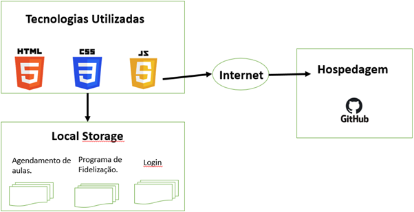

# Arquitetura da Solução

Pré-requisitos: <a href="https://github.com/ICEI-PUC-Minas-PMV-ADS/pmv-ads-2022-1-e1-proj-web-t5-gymmatch/blob/main/docs/04-Projeto%20de%20Interface.md"> Projeto de Interface</a>

Definição de como o software é estruturado em termos dos componentes que fazem parte da solução e do ambiente de hospedagem da aplicação.  
 
Nesta seção são apresentados os detalhes técnicos da solução criada pela equipe, tratando dos componentes que fazem parte da solução e do ambiente de hospedagem da solução. 

## Diagrama de componentes

Os componentes que fazem parte da solução são apresentados na Figura que se segue. 

Figura 15 - Arquitetura da Solução

A solução implementada conta com os seguintes módulos:
- **Navegador** - Interface básica do sistema  
  - **Páginas Web** - Conjunto de arquivos HTML, CSS, JavaScript e imagens que implementam as funcionalidades do sistema.
   - **Local Storage** - Armazenamento mantido no Navegador, onde são implementados bancos de dados baseados em JSON. São eles: 
     - **Agendamento de aulas** 
     - **Programa de Fidelização**
     - **Login**
 

## Tecnologias Utilizadas

- HTML
- CSS
- JAVASCRIP

## Hospedagem

O site utiliza a plataforma do **Github** como ambiente de hospedagem do site do projeto.
 

