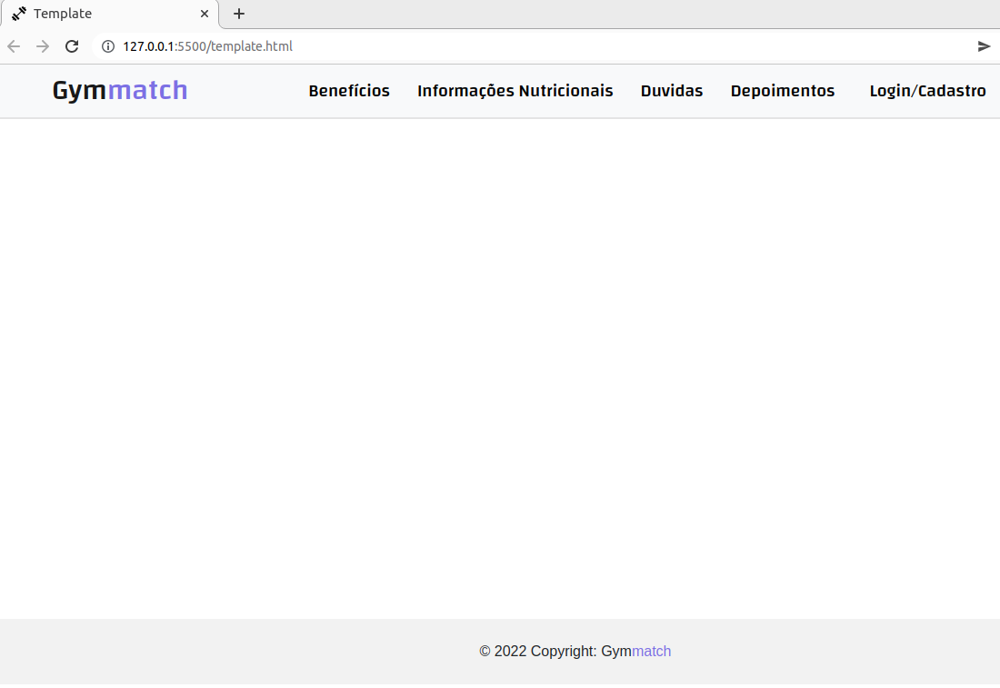

# Template padrão do site

<h1> Template </h1>

O padrão de layout a ser utilizado pelo site tem correspondência ao projeto de interface representado conforme figura 16:

Figura 16 - Template padrão do site.

O template criado está disponível no site https://github.com/ICEI-PUC-Minas-PMV-ADS/pmv-ads-2022-1-e1-proj-web-t5-gymmatch, ele é composto pelo seguinte layout:

    <strong>• Cabeçalho:</strong> parte superior do site, a qual fica destacado o conteúdo das páginas. A ideia é que esta parte do site contenha tudo que seja absolutamente necessário para a melhor navegação e experiência do usuário. Dessa forma, caso ele faça o primeiro acesso, ele pode facilmente encontrar o que busca. Por isso o cabeçalho contem as informações da logomarca, página inicial, benefícios, informações nutricionais, duvidas, depoimentos e login/cadastro. 
    <strong>• Conteúdo:</strong> área principal localizada no centro da página contendo as informações mais relevantes do site. 
    <strong>• Rodapé:</strong> pequena área na parte inferior da página contendo a logomarca.

    

A responsividade segue o padrão do Bootstrap.

