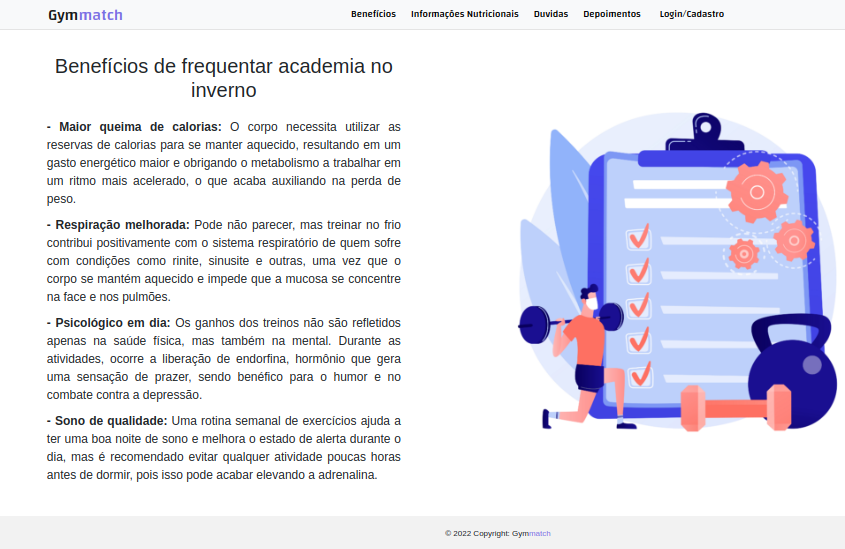

# Programação de Funcionalidades

<h2> Pagina inicial</h2>

 Home page é a página inicial do site, compreende uma apresentação do site e de todo o seu conteúdo, através dela o usuário terá acesso a todo o conteúdo do site.

  
 <strong>Requisitos atendidos</strong> 
RF-09 
RF-04 
RF-05 
RF-08 
RF-01 

 <strong>Artefatos de funcionalidade</strong> 
   artefatos usados para o desenvolvimento da pagina
 
> - index.css
> - index.html
> - alimentacao.jpg
> - cartoon.jpg
> - alunos.jpg

 

<h2>Benefícios (RF-09)</h2>

O site possui informações sobre os benefícios de praticar atividade em dias frios.

<strong>Requisitos atendidos</strong> 
RF-09 

<strong>Artefatos de funcionalidade</strong> 
 artefatos usados para o desenvolvimento da pagina
 
> - benefícios.html
> - benefícios.css

 

<h2>Informações Nutricionais (RF-04 e RF-05)</h2>

O site apresenta informações nutricionais personalizadas com horários e os intervalos recomendados para alimentação, quantidade ideal e os tipos de alimentos indicados para diferentes perfis de alunos. O site apresenta informações sobre os alimentos recomendados para uma alimentação pré-treino.

<strong>Requisitos atendidos</strong> 
RF-04 
RF-05 

<strong>Artefatos de funcionalidade</strong> 
 artefatos usados para o desenvolvimento da pagina
 
> - informaçõesNutricionais.html
> - informaçõesNutricionais.css

<h2>Dúvidas (RF-08)</h2>

O site possui uma página com dúvidas gerais para que os alunos possam consultar.

<strong>Requisitos atendidos</strong> 
RF-08 

<strong>Artefatos de funcionalidade</strong> 
 artefatos usados para o desenvolvimento da pagina
 
> - dúvidas.html
> - dúvidas.css

<h2>Depoimentos (RF-01)</h2>

O site possui uma tela de depoimentos para os alunos relatarem suas experiencias.

<strong>Requisitos atendidos</strong> 
RF-01 

<strong>Artefatos de funcionalidade</strong> 
 artefatos usados para o desenvolvimento da pagina
 
> - depoimentos.html
> - depoimentos.css

