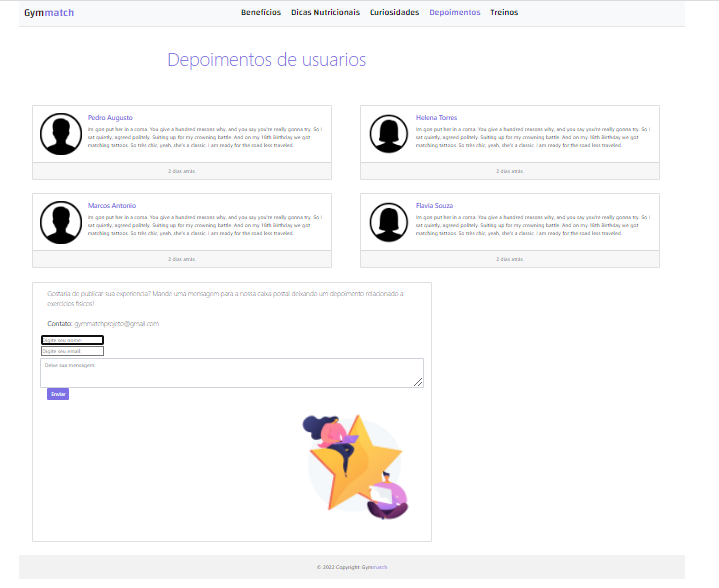

# Programação de Funcionalidades

<h2> Página inicial</h2>

 Home page é a página inicial do site, compreende uma apresentação do site e de todo o seu conteúdo, através dela o usuário terá acesso a todo o conteúdo do site.

  
 <strong>Requisitos atendidos</strong> 
RF-02 
RF-03 
RF-04 
RF-06 
RF-07 
RF-08 

 <strong>Artefatos de funcionalidade</strong> 
   Artefatos usados para o desenvolvimento da pagina
 
> - index.html
> - index.css

 <strong>Desenvolvedor:</strong> Matheus.

 

<h2>Benefícios (RF-06)</h2>

O site possui informações sobre os benefícios de praticar atividade em dias frios.

<strong>Requisitos atendidos</strong> 
RF-06 

<strong>Artefatos de funcionalidade</strong> 
 Artefatos usados para o desenvolvimento da pagina
 
> - benefícios.html
> - benefícios.css

 <strong>Desenvolvedor:</strong> Welbscley.

 

<h2>Informações Nutricionais (RF-03 e RF-04)</h2>

O site apresenta informações nutricionais personalizadas com horários e os intervalos recomendados para alimentação, quantidade ideal e os tipos de alimentos indicados para diferentes perfis de alunos. O site apresenta informações sobre os alimentos recomendados para uma alimentação pré-treino.

<strong>Requisitos atendidos</strong> 
RF-03 
RF-04 

<strong>Artefatos de funcionalidade</strong> 
 Artefatos usados para o desenvolvimento da pagina
 
> - nutricao.html
> - nutricao.css

 <strong>Desenvolvedor:</strong> Roberto.

 

<h2>Curiosidades (RF-07)</h2>

O site possui uma página com Curiosidades para que os alunos possam consultar.

<strong>Requisitos atendidos</strong> 
RF-07 

<strong>Artefatos de funcionalidade</strong> 
 Artefatos usados para o desenvolvimento da pagina
 
> - duvidasGerais.html
> - duvidasGerais.css

 <strong>Desenvolvedor:</strong> Raul.

 

<h2>Treinos (RF-02)</h2>

O site apresenta uma página com dicas de treino.

<strong>Requisitos atendidos</strong> 
RF-02 

<strong>Artefatos de funcionalidade</strong> 
 Artefatos usados para o desenvolvimento da pagina
 
> - treinos.html
> - treinos.css

 <strong>Desenvolvedor:</strong> Matheus, Raul, Roberto e Welbscley.

 

<h2>Depoimentos (RF-05 e RF-09)</h2>

O site apresenta uma página com depoimentos.

<strong>Requisitos atendidos</strong> 
RF-05 
RF-09 

<strong>Artefatos de funcionalidade</strong> 
 Artefatos usados para o desenvolvimento da pagina
 
> - depoimentos.html
> - depoimentos.css

 <strong>Desenvolvedor:</strong> Matheus, Raul, Roberto e Welbscley.

 
