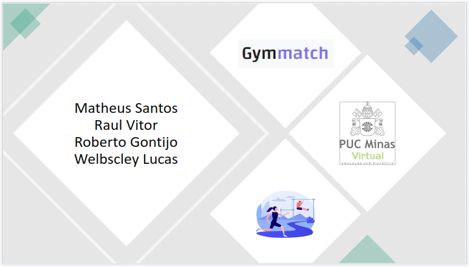
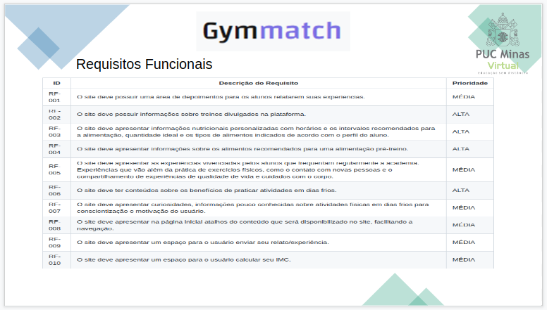
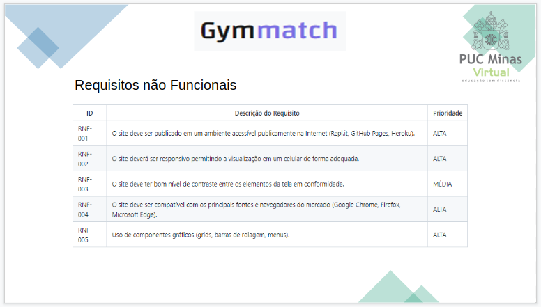
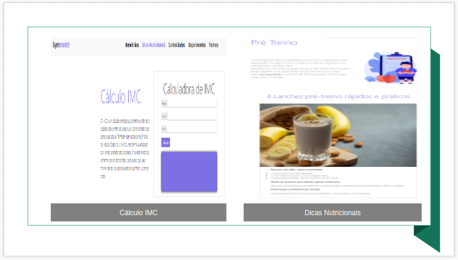
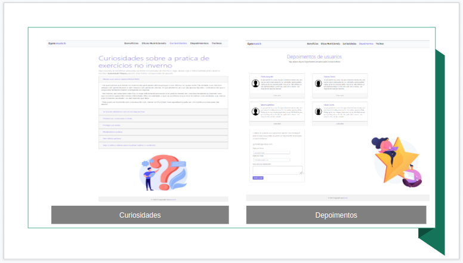

# Apresentação

Pré-requisitos: Todos os demais artefatos

Conjunto de slides em um arquivo PowerPoint ou PDF com a apresentação do projeto contemplando todos os itens trabalhados nos demais artefatos.

## Título do Projeto

Nome e marca do projeto

## Identidade Visual (Marca, Design)

O grupo deve ter o cuidado em utilizar figuras, imagens, e cores dentro do contexto da solução proposta, de forma a manter a temática do problema.

> **Links Úteis**:
>
> - [10 dicas de design para slides](https://rockcontent.com/blog/design-para-slides/)
> - [7 dicas de design para criar apresentações de PowerPoint incríveis e eficientes](https://www.shutterstock.com/pt/blog/7-dicas-de-design-para-criar-apresentacoes-de-powerpoint-incriveis-e-eficientes)
> - [Especialista do TED dá 10 dicas para criar slides eficazes e bonitos](https://soap.com.br/blog/especialista-do-ted-da-10-dicas-para-criar-slides-eficazes-e-bonitos)

## Conjunto de Slides (Estrutura)

O grupo deve distribuir de forma coerente o conteúdo a ser apresentado, dentro do tempo determinado. Importante ressaltar a importância da descrição clara de todo o andamento do projeto, insumos gerados e requisitos atendidos.

> **Links Úteis**:
>
> - [A regra 10-20-30 para apresentações de sucesso](https://revistapegn.globo.com/Noticias/noticia/2014/07/regra-10-20-30-para-apresentacoes-de-sucesso.html)
> - [Top Tips for Effective Presentations](https://www.skillsyouneed.com/present/presentation-tips.html)
> - [How to make a great presentation](https://www.ted.com/playlists/574/how_to_make_a_great_presentation)

 

  

  

  

  

  

  

  

  

  

  

  
